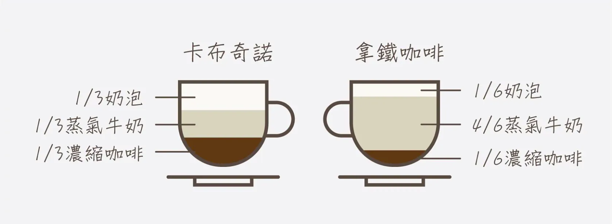

我們不會說把黑咖啡和牛奶分開喝，跟喝拿鐵的體驗相同。

拿鐵之所以是拿鐵，並不是因為它「包含」咖啡與牛奶，而是因為它們在同一個杯子裡，以特定的比例、方式與順序結合在一起。只要其中一個條件不適當，它就不會成為拿鐵，可能就會變成咖啡牛奶，或是卡布奇諾。

在這個意義下，拿鐵可以被視為一種湧現。當我們關心的是「拿鐵是什麼」，而不是「它由什麼組成」，那這個整體本身，才是我們真正指認的對象。一旦再往下拆解，它承載的意義也就會隨之消失。

雖然在分析時，我們仍然可以把事物拆成更小的部件，但若只分別關注單一部件，往往會失去觀察上層湧現的焦點。所以，我認為有必要先理解它作為一個整體所呈現的本質，並了解到隨著分析層級的下降，有些特性與互動會變得不可見。如果忽略這一點，很容易在分析過程中誤以為自己仍在理解同一個對象，實際上卻已經偏離了本質。
