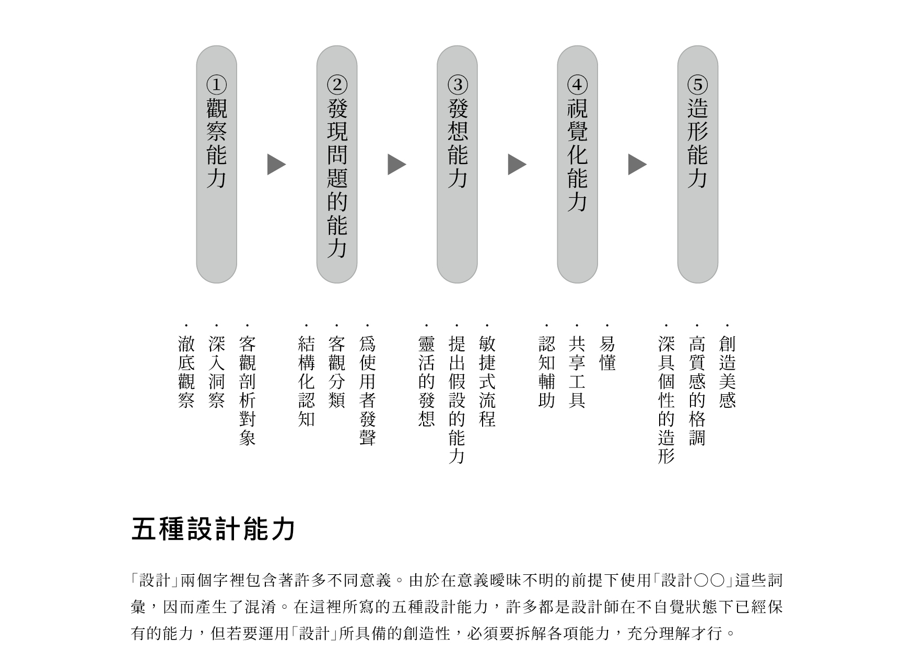
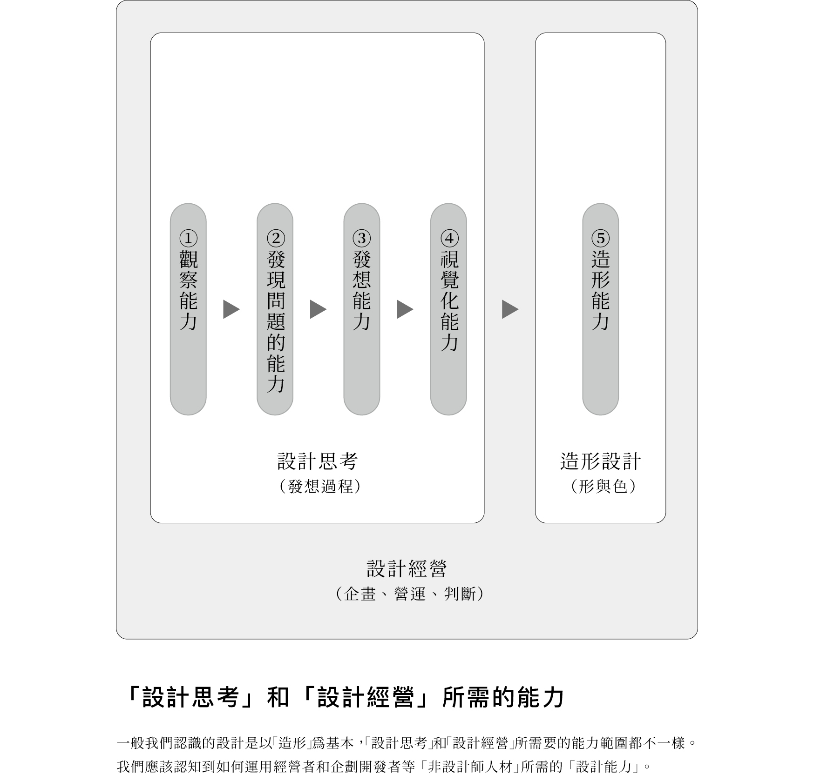

> [!note]
> 以下內容整理自田中一雄的[設計的本質](https://www.taaze.tw/products/11100981676.html)第一章。

如果設計不是指單純畫畫，那麼所謂的設計能力到底是指什麼？

1. **觀察能力**：運用徹底觀察、深入洞察、客觀剖析對象等手法來描寫對象的能力。
2. **發現問題的能力**：將糾結複雜的問題結構進行客觀分類，替使用者發聲，找出生活行為中各種問題的能力。藉由深入觀察對象，可以發現問題、產生「覺察」。
3. **發想能力**：靈活的提出假設，引導出具創造性的創新、自由發想，正是「設計思考」的目的。並以敏捷式的流程進行假設驗證，不斷嘗試錯誤。
4. **視覺化能力**：實踐設計思考的必備工具。將發現或思考的結果，透過簡明易懂的視覺化，來塑造專案團隊的共識。難以用文字或公式來傳達的事，也可以進行結構性整理，以圖解方式來增加易懂性。
5. **造形能力**：這才是過去大家所知道的「設計能力」。除了外觀上的美之外，當然也包含了功能性、優異品質等高度平衡能力。

上述 1~4 的能力與其說是專屬於設計師的能力，更可說是「設計思考」應該具備的能力。因此，即使不是設計師，當然也能不拘泥於既定概念，進行創造性發想。

另外，在「設計思考」中並不包含一般設計認知中的「5. 造形能力」。因為「設計思考」的物件並非形與色這種造形性，只是在企劃構想階段，希望藉由設計師式的自由發想，來引導出具創造力的創新。

