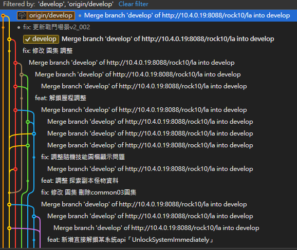

這是某間公司某天專案出狀況時，Fork 顯示的的歷史紀錄。我想知道昨天到今天到底誰幹了什麼事情，可以看到我甚至已經只顯示 develop 支線了，理論上應該要能清楚知道的開發歷程，現在直接看過去能獲得的資訊卻非常有限。

歷史紀錄已經被沒有意義的 merge 訊息佔據了。如果當下的版本出了嚴重的問題，也很難去尋找特定的 commit，因為大家的支線其實並沒有那麼單純，另外也有可能是 merge 解衝突時造成的問題。

如果你的隊伍只會 pull with merge，那麼 Git 歷史紀錄的意義，就會被這些複雜的合併點吞噬掉。
