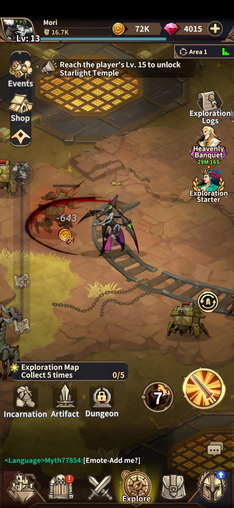
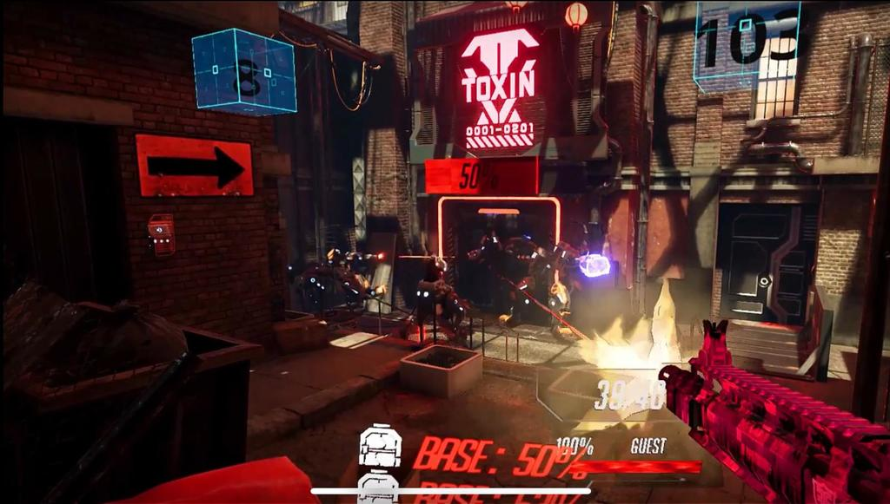
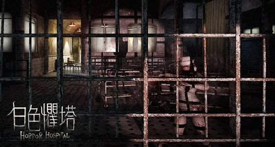
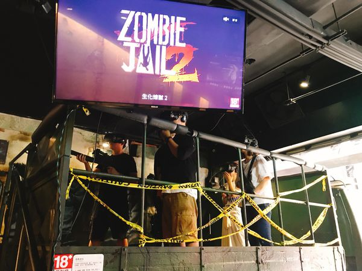
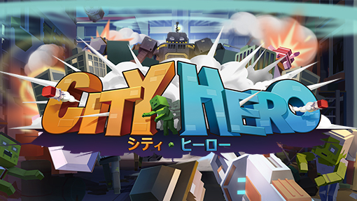
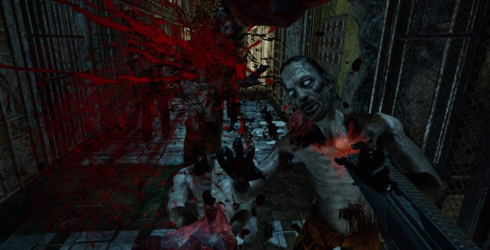
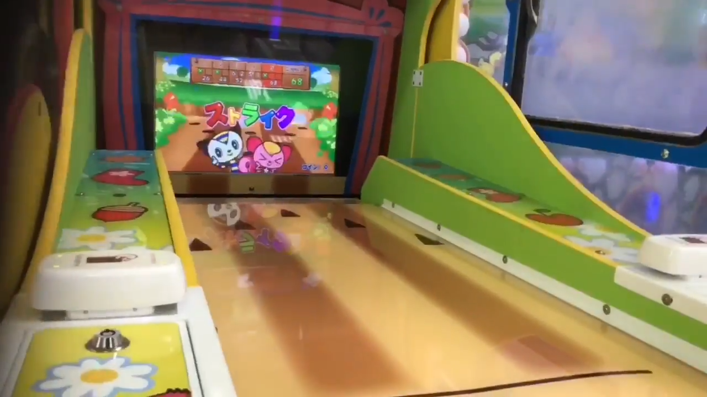

<link rel="stylesheet" href="/index.css"/>

我是 Unity 遊戲工程師，擁有 10 年工作經驗。主要負責通用功能與架構開發，像是核心玩法、UI、編輯器。也會負責管理軟體架構與 Git。經常研究與提供解決方案，也會指導初階工程師。

<h2>遊戲專案</h2>

  

    <h3>Cyber Parkour</h3>
    

      <li>使用 Unity 與 Fusion 開發 2D 平台競速對戰手機遊戲</li>
      <li>使用 PlayFab 與 Azure Functions 開發後端功能</li>
      <li>負責整體架構開發</li>
      <li>製作技能編輯器</li>
      <li>協助設計師規劃 AI 行為樹設計架構</li>
      <li>教導初階工程師如何正確寫程式與使用架構</li>
      <li>使用 Addressables 處理資源更新並制定包體規則</li>
      <li>制定 Google Play 與 Apple App Store 的發佈流程與版本分流</li>
    

  

  

    
  

  

    <h3>Myth Saga</h3>
    

      <li>使用 Unity 開發服務型手機 RPG</li>
      <li>負責自動掛機打寶系統的所有客戶端功能，包含 AI 與 socket 中間層</li>
      <li>負責公會領地戰爭系統的所有客戶端功能</li>
      <li>開發與維護服務型手遊的各種常見功能</li>
    

  

  

    
  

  

    <h3>ProjectMD</h3>
    

      <li>使用 Unity 開發 2D 回合制手機遊戲</li>
      <li>負責整體架構開發</li>
      <li>製作技能編輯器</li>
      <li>制定 Addressables 工作流程</li>
      <li>使用 Google App Script 編寫資料下載頁面，輸出設計師在 Google Sheet 填寫的資料表</li>
      <li>編寫定點數函式庫，以解決網路傳輸造成的浮點數誤差</li>
    

  

  

    
  

  

    <h3>女神聯盟M</h3>
    

      <li>服務型手機遊戲的開發維護</li>
      <li>撰寫前後端服務的程式碼，前端語言使用 Lua，後端語言使用 Go</li>
    

  

  

    <h3>Over Kill</h3>
    

      <li>VR 多人對戰射擊遊戲</li>
      <li>使用 Java 開發多人連線射擊遊戲的遊戲伺服器。</li>
      <li>使用 Java 實作 3D 空間與碰撞偵測，有單元測試驗證。</li>
      <li>使用 recast4j 來處理路徑搜尋。</li>
      <li>使用 LWJGL 渲染遊戲伺服器的戰場，用來偵錯。</li>
      <li>將原本在 Unity 上用 C# 編寫的 AI 套件轉寫成 Java 版本，讓設計師可以用同一份資料。</li>
    

  

  

    
  

  

    <h3>白色懼塔</h3>
    

      <li>VR 恐怖遊戲，需要玩家做簡單互動。</li>
    

  

  

    
  

  

    <h3>屍獄末日2</h3>
    

      <li>VR 多人合作射擊遊戲，接續 1 代製作。</li>
    

  

  

    
  

  

    <h3>城市英雄</h3>
    

      <li>VR 多人合作射擊遊戲，風格偏兒童向。</li>
      <li>不同武器的變化性比較大。</li>
      <li>可以破壞場景物件。</li>
    

  

  

    
  

  

    <h3>屍獄末日</h3>
    

      <li>VR 多人合作射擊遊戲，使用 HTC VIVE。</li>
      <li>使用 NodeCanvas 給設計師自行決定出怪與演出的流程圖。</li>
      <li>簡易斷肢功能。</li>
    

  

  

    
  

  

    <h3>拉拉保齡</h3>
    

      <li>兒童機台遊戲，用2條紅外線感測器偵測球的進入點。</li>
      <li>接手超過 90% 的類別都是 Singleton 的專案，將其重構成可維護的架構。</li>
      <li>重新實作與硬體裝置通訊的 Unity 插件。</li>
      <li>因為只能使用低規格機器，需要特別做效能最佳化，保證執行幀數 24 小時均維持在 60FPS。</li>
    

  

  

    
  

