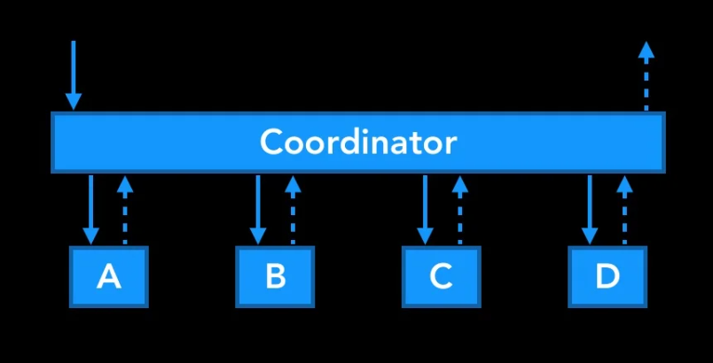

Coordinator Pattern 是由 iOS 社群的 Soroush Khanlou 在 2015 年提出，用來解決 View Component 互相創建的混亂。

當應用程式越來越大的時候，就會發現 UI 之間的流動切換與 UI 自身的呈現邏輯，不應該由同一個類別處理，否則會造成 View Component 難以重複使用。View Component 本身應該只著重在處理自己的 View。

Martin Fowler 曾經提過 Application Controller Pattern，Coordinator 就是 iOS 的 Application Controller。

使用 Coordinator 有以下好處：(注意這是 iOS 開發者的視角)
1. ViewController 之間是獨立的
2. ViewController 可重複使用
3. 工作流程被封裝
4. 避免顯示面的事件產生副作用
5. Coordinator 完全由開發者掌控

## References

- [Khanlou | Coordinators Redux](https://khanlou.com/2015/10/coordinators-redux/)
- [P of EAA: Application Controller (martinfowler.com)](https://martinfowler.com/eaaCatalog/applicationController.html)
- [Advanced coordinators in iOS – Hacking with Swift](https://www.hackingwithswift.com/articles/175/advanced-coordinator-pattern-tutorial-ios)
- [Pattern Coordinator Flow in Unity (gamedeveloper.com)](https://www.gamedeveloper.com/programming/pattern-coordinator-flow-in-unity)
