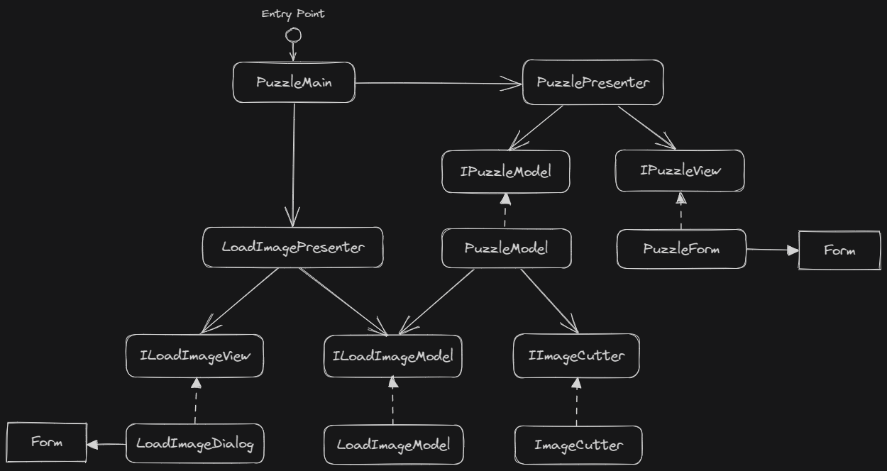

使用者打開 UI 時，程式要做的事情可能有哪些？

- 從伺服器/本地檔案取得使用者資料
- 根據資料設置 UI 元素
- UI 演出流程
- 處理使用者操作

有沒有注意到，在描述以上流程的時候，出發點並不是視覺面。因此從思考的方向來說，UI 的進入點不應該是 View，而是 Presenter。

這是 Presenter First 的概念，這個技巧是 2006 年提出的。因為使用者故事很自然地從 Presenter 出發，先寫 Presenter 就可以先呼叫 mock 方法（特別是不太能測試的 View），讓 TDD 流程更完整的思考方式。

從當年範例畫出來的類別圖，很明確的看到 Presenter 作為進入點的狀況。

就算你不寫測試，這個架構也有好處。因為有很多操作，跟 UI 其實沒有太大關係。UI 之間的轉換，主要也不是靠 View 自己決定怎麼轉換的。因此，實作 UI 時，應該使用 Presenter 的概念來實作進入點，並作為單一 UI 的核心。甚至在整個 GUI 應用程式，都應該使用這樣的思維，而不是從視覺面當作思考引導。

## References

- [Presenter First Resources (atomicobject.com)](https://atomicobject.com/resources/presenter-first)
- [PresenterFirstAgile2006.pdf - Google 雲端硬碟](https://drive.google.com/file/d/1e5gaTiJEO8-fu2rfRFgAWYubQ2tlyI9o/view)
