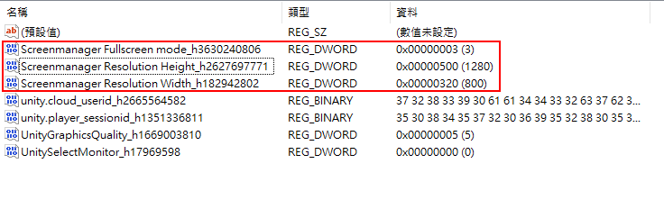

## Windows

1. 開啟登錄編輯程式 (搜尋輸入 regedit)
2. 找到 `HKEY_CURRENT_USER\Software\<CompanyName>\<ProductName>`
3. 可以看到資料夾內有全螢幕與解析度的設定，刪除這幾筆資料

## References

- [How to set a Custom Unity Fullscreen Resolution (cinema-suite.com)](https://cinema-suite.com/unity-tip-running-a-custom-fullscreen-resolution/)