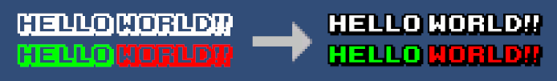
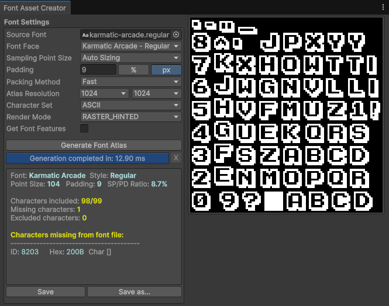
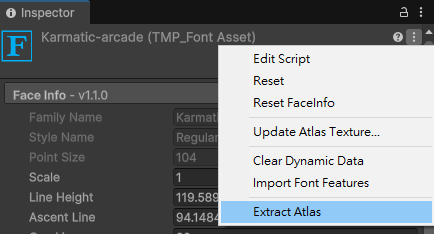
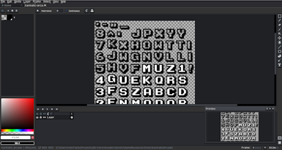
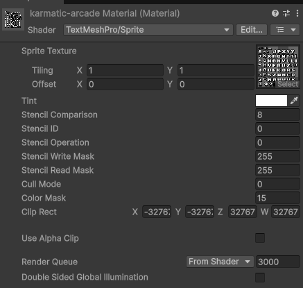

找到了個不錯的 Pixel 風格字體，結果是鏤空的。仔細想想的確一般的字型檔案都只支援一種顏色。不過遊戲的字型呈現基本上是由 Texture 與 Shader 構成的，而且感覺有人做過，所以應該會有方法可以解決。

這種看起來像外框線的效果，若是一般字體大部份都能用內建效果解決。但這種 Pixel 風格的字體，使用 Outline 之類的內建效果，通常沒辦法達到美術的需求標準，所以得透過這種方法來處理。

> [!info]
> 如果你有查到 `Create Editable Copy` 的做法，這個是舊時代的做法，產生出來的 `FontSettings` 只能給舊時代的 `Text` 組件使用，沒辦法給 `TextMeshPro` 用，也沒辦法用它生成 `TMP_Font`。（我覺得應該是要可以啦，可能太冷門的功能官方不想做。）
> 
> Reference: https://gamedev.stackexchange.com/a/192580

> [!info]
> 通常當你想要這樣做的時候，我覺得應該會是英文字母這種數量級的情境。理論上中文字體也做得到，但美術應該會改到吐出來。

## 做法步驟

1. 匯入字型。這裡使用免費的 [Karmatic Arcade](https://www.1001fonts.com/karmatic-arcade-font.html) 字型。

2. 打開 `Window -> TextMeshPro -> Font Asset Creator`，製作 Static 字體。等等輸出 Atlas 的時候，需要既有的字元圖片，所以不能用 Dynamic。
	- 我對這裡的設定沒那麼熟悉，我只知道因為我的情境是 Pixel 字體，需要清晰的銳利邊緣，所以不能使用預設 SDF 系列的演算法，要改用其它的。

	

3. 產生 `TMP_Font` 資源後，在資源右上角的選單，選擇 `Extract Atlas`。  
   

4. 使用你的圖片編輯工具（e.g. Aseprite, Photoshop），看你想要怎麼調整。以我的案例來說，我需要把內部填滿白色。  
  

5. 回到 Unity，把該字體所屬的材質球的 Shader 換成 `TextMeshPro/Sprite`，然後把 `Sprite Texture` 換成新的 Atlas。
	- 這裡的做法跟參考的 Code Monkey 影片中的做法不同，我覺得使用這個 Shader 才比較合理。
	- 沒辦法使用 Material Preset，因為需要 Atlas 相同才符合 Preset 的列表過濾條件。  
  
	

6. 完成！  

> [!todo]
> 應該之後會想要做自訂的雙色 shader

## References

- [How to use a Custom Font with Text Mesh Pro in Unity (Custom Texture, Add effects in Photoshop) - YouTube](https://youtu.be/nBcP7FaDPE0?si=2cu3kQdGiGcmy_Du)
