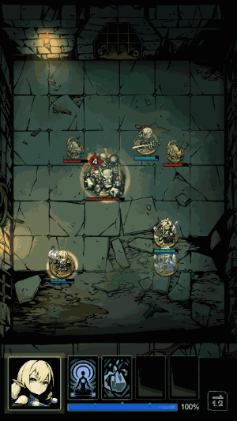

這個專案算是轉捩點，驗證我作為工程師是否足夠獨當一面。  
這個專案只做完核心玩法，團隊就解散了。所以還沒驗證到外圍開發的部分。  
但很遺憾，這時候還是不夠好。

架構上後來想想可以再優化，不過當時也沒感覺到太大問題，順利的適應了各種大型設計改動。  
不過有幾個很決定性的錯誤決策。

## 技能編輯器

這個玩法是類似怪物彈珠的回合制 Roguelike 系統。

我過去寫過其它 RPG 技能系統的練習，知道若要寫比較複雜的技能內容，像是 `if-else` 或 `for-loop` 之類的，用 Scriptable Object 基本上會死得很難看。而且如果玩法要進伺服器做驗算，就更不應該用 Scriptable Object。

我以前看過別人用 Excel 條列式的寫技能，但從我的角度來說真的很難編輯，設計師大概也不喜歡。所以這次在 Unity 寫了個編輯器，基本上由下拉式選單和數值欄位組成，完全是資料形式，後來想想其實跟 Excel 的條列式很像。

但結果用起來，在比較複雜的狀況，設計師就開始不知道怎麼編輯了。在 UX 體驗上，也很難去支援比較複雜狀況的編輯。另外要整合演出面的時候，除了功能上很難去安插各種特殊的演出，設計師也常常不知道該怎麼編輯。

這次的經驗，讓我去思考如何去製作更加通用，更加容易改動的系統，衍生了後來 [[flexi|Flexi]] 的想法。

## 資料表格

關於資料表格，當時沒有辦法說服設計師使用 Excel。只能寫 Google App Script 從 Google Sheet 上下載 json 資料，但是當設計上需要回溯版本之類的操作時，就會碰到 Google Sheet 很難追蹤版本的問題。

後面進來的設計師甚至跟我抱怨：「你為什麼沒有說服他！」( ˘･з･)

不過當時手上的 Excel Exporter 也還有很多我不滿意的地方。總之後來休息階段的時候，才根據學長給我的資料，寫了比較完整的 ExcelDataExporter 給自己用。

